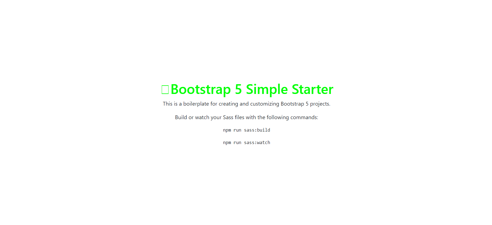

# Bootstrap 5 Simple Starter

This is a simple boilerplate for creating and customizing Bootstrap websites. Just run the `npm run sass:watch` command and customize Bootstrap by changing the variable values.

## Usage

Install dependencies:

```bash
npm install
```

This will install Bootstrap, Sass and Font Awesome.

## Compile Sass

To build your CSS files from Sass, run:

```bash
npm run sass:build
```

## Watch Sass

To watch your Sass files for changes, run:

```bash
npm run sass:watch
```
After run the above command, just open your HTML web page in browser then you will be able to see the following output.



* To customize, add the Bootstrap variables to the `bootstrap.scss` file. You can look at the file `node_modules/bootstrap/dist/scss/_variables.scss` for a list of all the variables. Do NOT edit the `variables.scss` file directly, as it will be overwritten when you update Bootstrap.

* To add your own custom styles, use the `styles.scss` file.